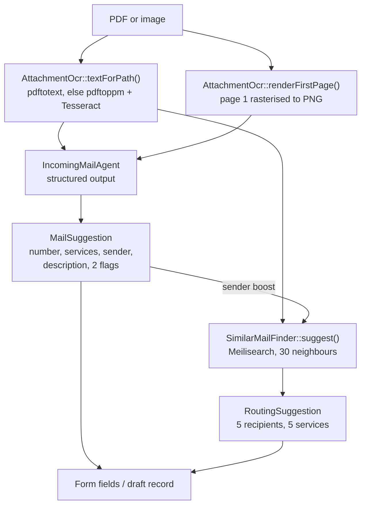

# AI-assisted encoding of incoming mail

The mail room receives paper. It is opened, stamped with a reception stamp (an
indicator number, a date, sometimes the destination services), scanned on a
multifunction printer and mailed to an IMAP account. Someone then reads each
scan and retypes it into the *indicateur*: number, date, sender, subject,
services, recipients.

This feature does that retyping. A document goes in; a courrier comes out, with
its fields filled and its routing proposed, for a human to check and validate.

It is still a trial: everything below is only offered to users holding the
`INTRANET_ADMIN` role (`AnalyzeAttachmentAction::isUnderTrialFor()`, shared by
the form button and the Inbox bulk action).

---

## What the AI does, and what it does not

Two different mechanisms sit behind the one word "AI", and keeping them apart is
the single most important thing to understand about this feature.

| | Source | Answers |
|---|---|---|
| **Reading** | An OpenAI model, shown the document | What is *written on the paper*: indicator number, sender, subject, registered/acknowledgment flags, and the service initials inked on the stamp |
| **Routing** | Meilisearch, over the 166.000 courriers already encoded | Where the mail *goes*: which services and which recipients |

The model is never asked where a courrier should be routed, because that is not
written on it. Measured over 16.000 recipient links since 2024, the surname of
the person the mail was given to appears in the letter text **13%** of the time.
Routing is institutional knowledge — the mail room knows which desk handles a
planning permit — and the only place it is written down is the mail already
encoded. So it is *retrieved*, never reasoned.

Conversely, the retrieval is never asked to read the stamp. The two never
overlap except on one field, `primary_services`, where the stamp wins.

---

## The two entry points

### 1. One document, in the form — `AnalyzeAttachmentAction`

A « Compléter avec l'IA » link sits in the header of the "Informations du
courrier" section, on the create form, on the Inbox « Traiter » modal, and on a
draft being verified. It is **not** offered on a courrier a human has already
validated: the AI encodes a courrier, it does not revisit one, and its only
possible contribution there would be to overwrite a decision someone took on
purpose (`isEncodingRatherThanEditing()`).

The file is looked up in the order it becomes available:

1. the pending upload (`attachment_file`), when the user has just picked one;
2. the attachment already stored on the record, when editing a draft;
3. the IMAP message, when the action was mounted from the Inbox — it has no
   local copy, so it is streamed to a temporary file that is deleted in a
   `finally` block.

The result is pushed into the live form state; nothing is saved. The user reads
it and submits.

### 2. A whole selection, from the Inbox — `AnalyzeInboxMessagesJob`

« Traiter avec l'IA » is a bulk action on the Inbox table. It takes the ticked
messages that carry **exactly one attachment** (with none there is nothing to
read; with several nothing says which one is the courrier — the rest of the
selection is reported, not silently dropped) and queues a single job.

One job for the whole batch, not one per message: an analysis takes tens of
seconds, so twenty messages run for several minutes — hence `$timeout = 3600`.
`$tries = 1`, because a retry would create every draft twice over: once the IMAP
message is deleted, nothing links a draft back to it.

Each message becomes a **draft courrier**, the IMAP message is deleted (the
document now lives on the storage disk), and when the batch is done the
administrator is mailed a link to the first draft
(`IncomingMailDraftsReady`).

---

## The pipeline



### Step 1 — extract the text locally

`AttachmentOcr` runs first. A PDF with a text layer is read by `pdftotext`; one
without is rasterised by `pdftoppm` and read by Tesseract; images go straight to
Tesseract. Every step degrades to an empty string when a binary or a file is
missing, so nothing here can fail an encoding.

Text is extracted locally rather than by sending the whole file, because it is
far cheaper and the pipeline already existed for the search index. Past
`MAX_TEXT_LENGTH` (20.000 characters) the tail of a document is signature blocks
and boilerplate rather than the object of the mail, so it is cut.

### Step 2 — always attach a picture of page 1

**This is not an optimisation you can remove.** The indicator number comes from
the stamp inked on the paper *before* scanning: slanted, pale, next to a
handwritten initial. That is exactly what text extraction turns into noise or
drops.

Verified against real mails: sending the PDF with `Files\Document::fromPath()`
returns an empty `reference_number` — the provider hands the model the extracted
text only, where the stamp is missing or mangled. Rendering page 1 with
`renderFirstPage()` and sending it as `Files\Image` reads the stamp correctly
(002686, 2693).

So a text layer does **not** mean the document is born-digital — the MFP writes
searchable PDFs — and the rendered page always travels with the text. The prompt
tells the model which of the two to believe: the image is the document of record,
the text is a transcription.

### Step 3 — ask the model

`IncomingMailAgent` is a `laravel/ai` agent: `#[Provider(Lab::OpenAI)]`,
`#[Timeout(120)]`, with a `HasStructuredOutput` schema of six required fields.
Its instructions are in French, and lean on the layout of Belgian administrative
mail — NBN Z 01-002:2002, *classement et dactylographie des documents* — to help
it place each field: sender letterhead top-left, addressee block top-right
(always the commune, never the sender), place and date top-right,
« Objet »/« Concerne » for the description, signature at the foot.

The rubric that matters most, confirmed on a real SPW letter: **« Vos réf. » is
the addressee's reference — the commune's own — and « Nos réf. » is the
sender's.** Neither is ever the indicator number, which only comes from the
stamp.

The prompt says explicitly that handwritten letters, forms, printed emails and
invoices do not follow the norm and that the model should then fall back to the
content. Keep that escape hatch: a good share of incoming mail is handwritten.

| Field | What it holds |
|---|---|
| `reference_number` | Digits of the stamp, leading zeros included, no date, no service, no initial. Empty when no stamp is visible. |
| `services` | The service initials written on the stamp, one per entry, separators stripped (« 2693 - RH (CEE) » → `['RH', 'CEE']`). Never inferred from the content. |
| `sender` | The author of the letter. |
| `description` | The object, one line, 100 characters max. |
| `is_registered` | Registered mail. |
| `has_acknowledgment` | An acknowledgment of receipt is asked for or mentioned. |

Two traps encoded in the prompt:

- **The sender is the author of the letter, not of the covering email.**
  Incoming mail is often an internal email forwarding a citizen's letter, with
  the letter scanned as page 1 and the email printout on a later page. For a
  handwritten leave request forwarded by a crèche, the sender is the person who
  wrote it, not the crèche. This is another reason the analysis leans on the
  page-1 image rather than the full text, which mixes in the covering email.
- **Never feed the envelope to the model.** The subject is a scanner-generated
  filename (`SKM_C250…`) and the From is the copier. `IncomingMailAnalyzer`
  takes a file path only, on purpose.

The response comes back as `MailAnalysis` — a `MailSuggestion` plus the
extracted text. The text travels back because the callers need it twice: to
retrieve the routing, and to store on the record so that retrieval can be
repeated later. Extracting it again would mean a second OCR pass over the scan.

### Step 4 — resolve the stamped service codes

`ServiceRepository::findIdsByCodes()` maps the initials to rows, scoped to the
department the mail is being encoded in, since each department keeps its own
list.

**A code is kept only when it matches exactly one service.** Initials repeat both
across departments (RH exists in Ville and in Bgm) and inside one (MUS is both
the Musée and the Conservatoire), so an ambiguous code is dropped. Never widen
this to a `LIKE` search or a "best match": a wrong service silently misroutes the
mail.

### Step 5 — retrieve the routing

`SimilarMailFinder` throws the letter's text at the Meilisearch index and tallies
the services and recipients of the mails that come back.

- The query is built from the letter's distinctive words: shorter than 4
  characters, numeric, or in the `NOISE_WORDS` list (the boilerplate every
  administrative letter shares) are dropped, deduplicated, capped at
  `QUERY_WORDS = 50`.
- `matchingStrategy: 'frequency'` — the default strategy drops words from the
  end of the query, which for a letter means dropping its body and keeping its
  letterhead.
- `NEIGHBOURS = 30` hits are read. Each votes with weight `1 / (rank + 2)`,
  tripled (`SAME_SENDER_WEIGHT`) when the hit comes from the same correspondent:
  the same sender writing about the same thing is the strongest neighbour there
  is.
- Filters: the department, the mail itself (`excludeId`) and everything encoded
  after it (`before`) — a suggestion must only ever rest on what was already
  known.
- `CANDIDATES = 5` are returned per field.
- The index being unreachable returns an empty suggestion and reports the
  exception. A courrier must still be encodable with Meilisearch down.

Measured on 2026 mail, retrieving only from earlier mail in the same department:

| Query | Recipient top-1 | Recipient top-5 |
|---|---|---|
| Text + sender boost | 43% | 67% |
| Text alone | 40% | — |
| Sender alone | 21% | — |

So **the text carries the signal, not the sender** — the reverse is true for
services, where the sender alone is nearly as good (47% vs 50%), because a
correspondent maps to a desk while a topic maps to a person. That is why the
sender boost is kept even though it does little for recipients.

### Step 6 — write it into the courrier

Only the **top two** candidates per field are written
(`RoutingSuggestion::WRITTEN`, via `topRecipientIds()` / `topServiceIds()`). The
ranking below that is made of alternatives, not of extra destinations, and every
extra row is one the user deletes by hand.

Three conditions govern every write, in both entry points:

- **Only into an empty field.** A routing the user already picked outranks a
  retrieval.
- **The stamp outranks the retrieval for services.** It is the mail room's own
  word. `AnalyzeInboxMessagesJob::attachRouting()` skips the services entirely
  when `findIdsByCodes()` resolved any; the form action checks the field is
  blank, which the stamp step has just filled.
- **Only while it is a draft** (or a form with no record yet). Nothing is ever
  written to a courrier a human has validated.

The same rule protects the other fields: `reference_number` is only proposed into
an empty field — it must not overwrite one already encoded, nor the sequential
number the CPAS department gets by default — while an empty `sender` or
`description` is left alone rather than wiping what the user typed. The two
toggles always take the suggested value.

Autofill is defensible here only because nothing filled this way is visible until
someone verifies it. Do not carry the behaviour over to a path that publishes
directly.

---

## Drafts

`incoming_mails.is_draft` marks a mail the AI encoded from an Inbox attachment
that no human has read yet. **Nothing about the flag is enforced by the model:
every read path has to exclude drafts itself**, and there are three.

- `IncomingMailRepository::scopeToTodayForCurrentUser()` and `withoutCategory()`
  — the listings.
- `IncomingMailRepository::findByDateAndNotNotified()` and
  `getIncomingMailsForRecipient()` — the recipient notifications. A draft going
  out here would mail unverified metadata to the whole commune.
- `IndexIncomingMailJob` — a draft is *deleted* from the index rather than
  indexed. It still extracts `content` for drafts even though it does not index
  them, or there would be nothing to query with while the draft is being
  verified.

Add the same exclusion to any new query that lists or notifies mail.

Drafts are worked through from `DraftIncomingMails`, or from the link in the
batch email. `EditIncomingMail` retitles itself (« Vérifier le brouillon »),
explains in its subheading that nothing has been read yet, and replaces the save
button with « Valider et suivant », which clears the flag and opens the next
draft — a batch is walked through without going back to a listing that does not
show them.

`validateDraft()` clears the flag from `afterSave()`, never inline:
`EditRecord::save()` swallows a validation failure and returns, so clearing it
next to the `save()` call would publish a mail the form rejected. The method
checks `$this->record->is_draft` afterwards to decide whether to redirect — a
mail the model left without an indicator number stops there.

Opening a draft also runs `withRetrievedRouting()`, which fills `primary_services`
/ `primary_recipients` if they are still empty. The batch normally does this at
creation; this catches the ones it could not — a draft encoded before the
retrieval existed, or one whose text only reached the index afterwards.

---

## Files

| Path | Role |
|---|---|
| `src/Ai/IncomingMailAgent.php` | The prompt and the structured-output schema |
| `src/Ai/IncomingMailAnalyzer.php` | Extract text, render page 1, prompt the agent |
| `src/Search/AttachmentOcr.php` | pdftotext / pdftoppm / Tesseract, and the text cache |
| `src/Search/SuggestsMailRouting.php` | Seam, so the form is testable without Meilisearch |
| `src/Search/SimilarMailFinder.php` | The retrieval: query building, neighbours, tally |
| `src/Dto/MailAnalysis.php` | Suggestion + extracted text |
| `src/Dto/MailSuggestion.php` | The six fields the model returns |
| `src/Dto/RoutingSuggestion.php` | Ranked candidates, and how many get written |
| `src/Filament/Actions/AnalyzeAttachmentAction.php` | The « Compléter avec l'IA » button |
| `src/Filament/Resources/Inbox/Tables/InboxTables.php` | The « Traiter avec l'IA » bulk action |
| `src/Jobs/AnalyzeInboxMessagesJob.php` | The batch: analyse, create drafts, mail the author |
| `src/Jobs/IndexIncomingMailJob.php` | Keeps drafts out of the index |
| `src/Mail/IncomingMailDraftsReady.php` | The « vos brouillons sont prêts » email |
| `src/Filament/Pages/DraftIncomingMails.php` | The draft queue |
| `src/Repository/ServiceRepository.php` | `findIdsByCodes()`, the stamp-code lookup |

`SuggestsMailRouting` is bound to `SimilarMailFinder` as a **scoped** binding in
`CourrierServiceProvider` — the app runs on Octane, and a per-request service
must not become a singleton.

---

## Configuration

```env
OPENAI_API_KEY=""

COURRIER_OCR_ENABLED=true
COURRIER_OCR_LANGUAGE=fra
COURRIER_OCR_MAX_PAGES=15
COURRIER_OCR_DPI=200
COURRIER_OCR_TIMEOUT=120
```

Requires the `poppler-utils` (`pdftotext`, `pdftoppm`) and `tesseract-ocr`
binaries with the `fra` language pack. Meilisearch must hold the `indicateur`
index for the routing retrieval to return anything. The batch needs a queue
worker running.

---

## Tests

| File | Covers |
|---|---|
| `tests/Feature/Courrier/IncomingMailAiCompletionTest.php` | The prompt gets the extracted text and the rendered page; each field is applied; already-encoded values are kept; the ambiguous stamp code is dropped; the trial gate |
| `tests/Feature/Courrier/RoutingSuggestionTest.php` | Query building and the empty cases; the top two are written and the third is not; nothing is written to a validated courrier; the Inbox modal |
| `tests/Feature/Courrier/IncomingMailDraftTest.php` | The bulk action and the batch job; drafts kept out of the listing, the notifications and the index; validate-and-next |

Three fakes make this testable without a network:

- `IncomingMailAgent::fake([...])` returns a canned structured response.
- A Mockery double bound on `SuggestsMailRouting` stands in for Meilisearch —
  `fakeFinder()` / `fakeRouting()` in the test files. Bind it in any test that
  touches the two routing selects, or the assertions answer from whatever the
  local index happens to hold.
- `FakeMailbox` / `FakeMessage` (`imap-engine`) stand in for the IMAP server;
  the fixtures in `tests/Fixtures/` are real scanned courriers, stamp included.

---

## Before you change any of this

The settled decisions and the traps behind them are recorded in
[`.ai/rules/ai.md`](../../.ai/rules/ai.md) (the prompt, the stamp, the sender)
and [`.ai/rules/search.md`](../../.ai/rules/search.md) (the retrieval, its
measurements, the autofill rules), with the draft invariants in
[`.ai/rules/courrier.md`](../../.ai/rules/courrier.md). Read them first — several
of the intuitions in this area turned out to be wrong when measured, twice.

Re-run the ablation before touching the retrieval weights — replay a slice of
already-encoded mail through `SimilarMailFinder` and count how often the top
candidate matches what the mail room chose. The measuring script is scratch and
is not committed. It is cheap to rewrite, and it is the only thing that has
actually settled an argument here.
